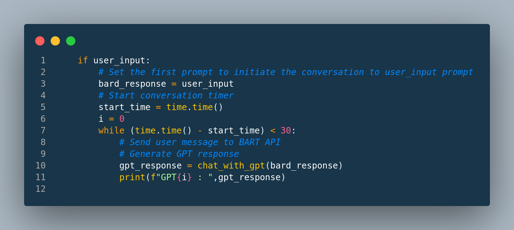

# GPT_BARD_STREET_FIGHT

# GPT & BARD CONVERSATIONAL APP
Can you guess who would win the conversation if we put chatgpt and bard to a conversational challenge?

## Run Locally

Clone the project

```bash
  git clone https://github.com/AI-Geekette/GPT_BARD_STREET_FIGHT.git
```

Create a python env

```bash
cd GPT_BARD_STREET_FIGHT/
python -m venv bardgpt_env
source ./bardgpt_env/bin/activate
```

Install requirements
```bash
  pip3 install -r requirements.txt

```

Add .env file to the project stucture

```bash
  touch .env
```

Add your OPEN_API_KEY and BARD cookie to .env file
```bash
BARD_API_KEY=<put_key_here_no_quotes>
OPEN_API_KEY=<put_key_here_no_quotes>
```


Run streamlit app
```bash
streamlit run main.py
```

Go to streamlit page on your browser
Give the bots a prompt about a conversation topic

Watch them talk

You can change the conversation time limit in while loop condition: default is 30 seconds
